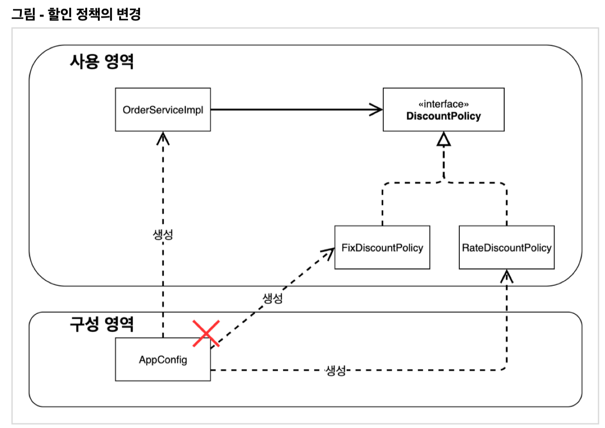
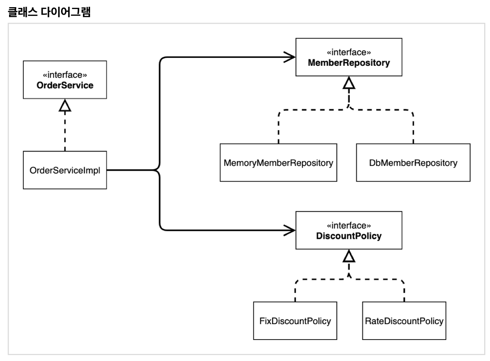
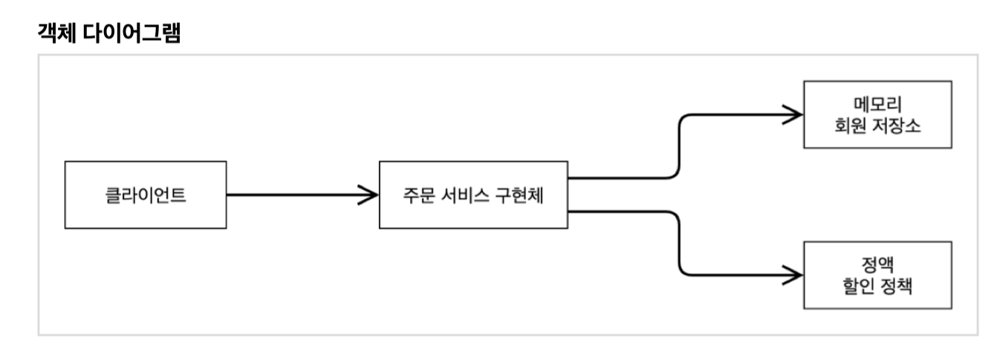

# 3. 스프링 핵심 원리 이해2 - 객체 지향 원리 적용

## 새로운 할인 정책 개발

- 새로운 정률 할인 정책 구현 - RateDiscountPolicy

## 새로운 할인 정책 적용과 문제점

### (새로운 할인 정책을 적용시 발견된) 문제점

- OrderServiceImpl - DiscountPolicy 와 FixDiscountPolicy 모두에 의존
  - DIP 위반 - 구체에 의존하지 말고, 인터페이스만 봐야한다는 법칙
- OrderServiceImpl에 FixDiscountPolicy -> DiscountPolicy로 변경
  - OCP 위반 - 확장된 기능을 적용하기 위해 client를 변경 (i.e 확장에
    열려있지 않음)

### 해결

- DIP 위반 -> 인터페이스에만 의존하도록 코드 수정.
  - `private final DiscountPolicy discountPolicy = new FixDiscountPolicy()` -> `private DiscountPolicy discountPolicy` 수정
  - **NPE(Null Point Exception) 발생** -> 구체화 클래스를 넣어줄 다른
    존재가 필요.

## 관심사의 분리

각 서비스(MemberServiceImpl, OrderServiceImpl)들은 자신에게 필요한 객체들(MemberRepository, DiscountPolicy)이 있을 때, 그 객체의 인터페이스를
아는 것 뿐만 아니라 구현체까지 선택하고 있다. \
각 서비스들은 자신에 필요한 객체들(즉, 의존관계 객체)들의 인터페이스만
알도록하고, 구현체 선택 및 생성은 다른 객체(AppConfig)에게 맡기자.

### AppConfig 등장

- 애플리케이션의 전체 동작 방식을 구성(Config)하기 위해, **구현 객체를
  생성**하고, **연결**하는 책임을 가지는 별도의 설정 클래스를 만들자.

### AppConfig 역할

- 애플리케이션의 실제 동작에 필요한 **구현 객체를 생성**한다.
- 생성한 객체 인스턴스의 참조(레퍼런스)를 **생성자를 통해서
  주입(연결)**한다.
  - 생성자 주입: Constructor injection

-> `객체를 생성하고 연결하는 역할`과 `실행하는 역할이 명확히 분리`:
관심사의 분리 \
-> `MemberServiceImpl`에서 보면 **자신의 의존 관계(ex.
memberRepository)**를 외부에서 주입해주는 것처럼 보여서, \
이를 **DI(Dependency Injection, 의존관계 or 의존성 주입)**이라고 한다.

### 정리

- AppConfig 역할 - 객체를 생성하고 주입
  - 생성자 주입
- DI (Dependency Injection)
- DIP, OCP 위반 -> DIP, OCP 준수

## AppConfig 리팩토링

- 사용영역(OrderServiceImpl, DiscountPolicy etc)와 구성영역(AppCon
  fig)가 **완전히 분리**되었다.

## 새로운 구조와 할인 정책 적용

- FixDiscountPolicy -> RateDiscountPolicy로 변경
- 이를 위해 변경 해야하는 부분은 only 구성영역인 **AppConfig의 discountPolicy()** (한 곳), 사용영역은 변경되지 않는다.

## 전체 흐름 정리

## 좋은 객체 지향 설계의 5가지 원칙의 적용

## IoC, DI, 그리고 컨테이너

### IoC (Inversion of Control, 제어의 역전)

- 옛날에는, 구현 객체가 프로그램의 제어 흐름을 스스로 조종.
- 반면 AppConfig 도입 이후에는 구현 객체는 자신의 로직을 실행하는
  역할만 담당하고 프로그램의 제어 흐름은 모두 AppConfig 담당한다.
- AppConfig 그리고 구현 객체와 같이 프로그램의 흐름을 직접 제어하는
  것이 아니라 **외부에서 관리하는 것을 제어의 역전(IoC)**라고 한다.

#### Framework(프레임워크) vs Library(라이브러리)

- 프레임워크는 내가 작성한 코드를 제어하고, 대신 실행한다. (ex. JUnit)
- 반면, 내가 작성한 코드가 직접 제어의 흐름을 담당한다면
  라이브러리이다.

### DI (Dependency Injection, 의존관계 주입)

- 의존관계는 **정적인 클래스 의존관계**와 **실행 시점에 결정되는 동적인
  객체(인스턴스) 의존관계**로 분리해서 생각해볼 수 있다.

#### 정적인 클래스 의존관계

- 클래스가 사용하는 import만 보고 의존관계를 파악하며, 애플리케이션을
  실행하지 않아도 알 수 있다.
- OrderServiceImpl이 MemberRepository, DiscountPolicy에 의존하는 것. \
   (but, 실제로 어떤 구현체가 OrderServiceImpl에서 사용될지는 알 수
  없다.)

#### 실행 시점에 결정되는 동적인 객체(인스턴스) 의존관계 (객체 다이어그램)

- 애플리케이션 실행 시점(런타임)에 외부에서 실제 구현 객체를 생성하고 \
   클라이언트에 전달해서 클라이언트와 서버의 실제 의존관계가 연결 되는
  것을 **의존관계 주입**이라 한다.
- 의존관계 주입을 사용하면, 정적인 클래스 의존관계를 변경하지 않고, \
  동적인 객체 인스턴스 의존관계를 쉽계 변경할 수 있다.

### IoC 컨테이너(-> DI 컨테이너)

- like AppConfig.
- 객체를 생성하고 관리하면서 의존관계를 연결해 주는 것
- 의존관계 주입에 초점을 맞춰서, 최근에는 주로 DI 컨테이너라고 한다.
  (IoC는 광범위하게 사용되서 헷갈릴 소지가 있음)
- or 어셈블러, 오브젝트 팩토리 등으로 불리기도 한다.
- 스프링이 DI 컨테이너 역할을 한다.

## 스프링으로 전환하기
